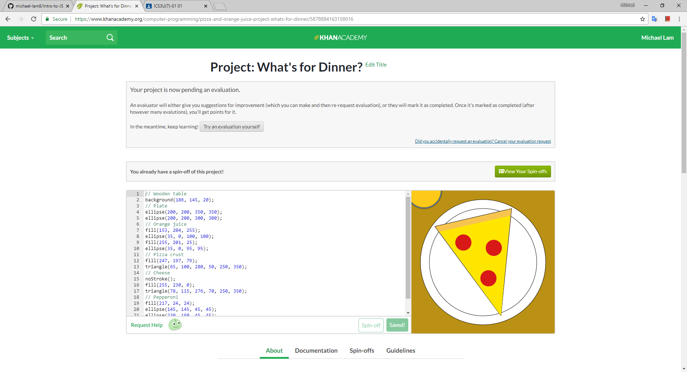
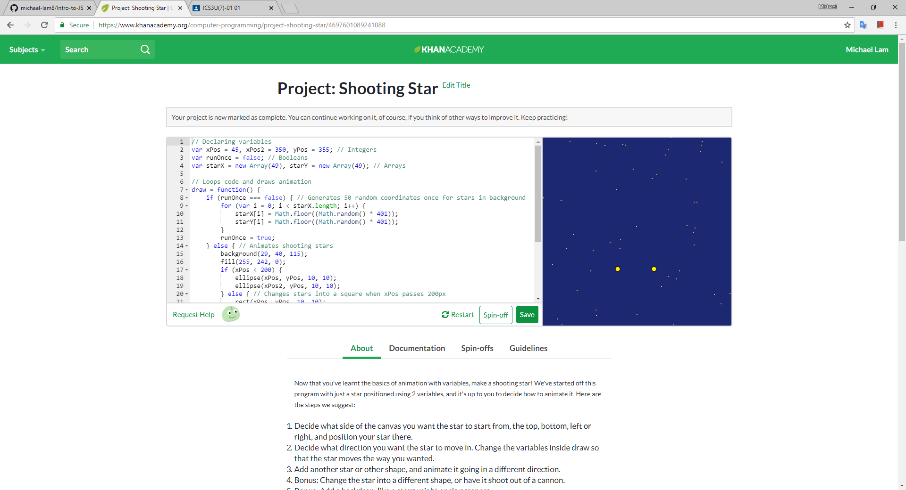
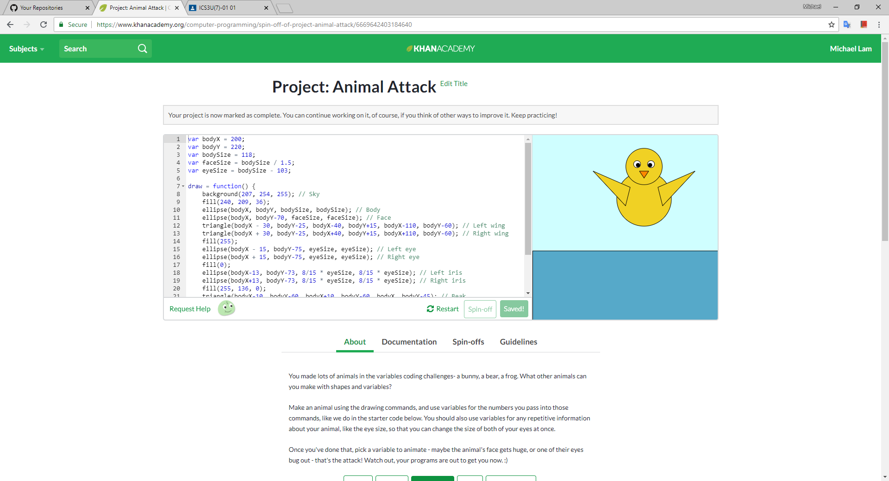
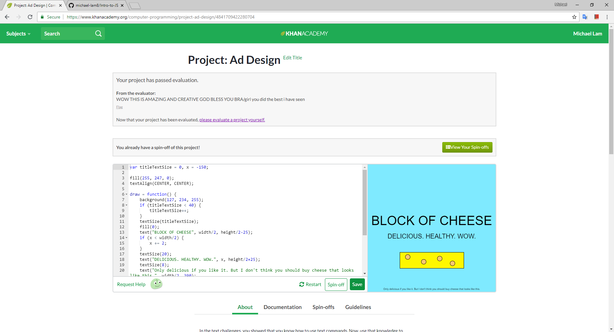
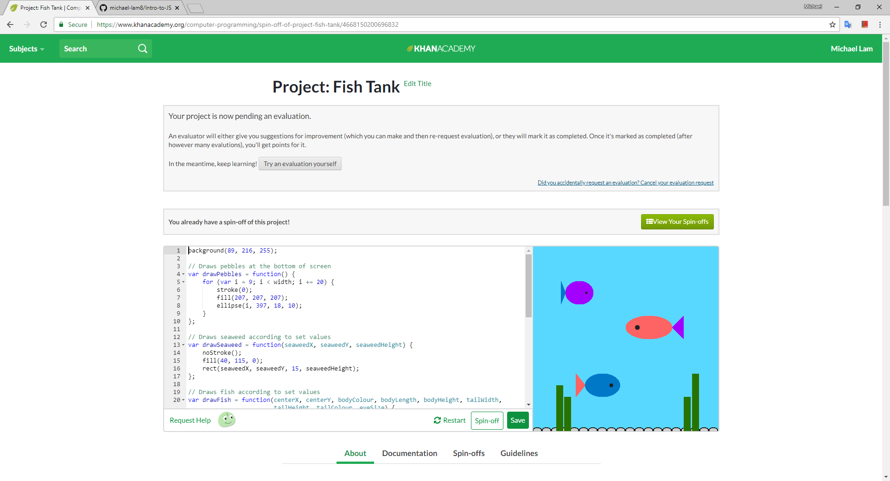
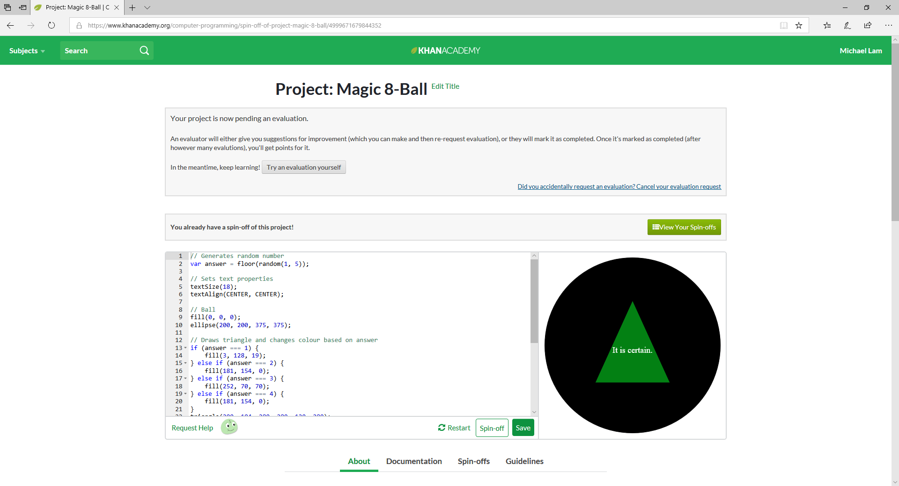
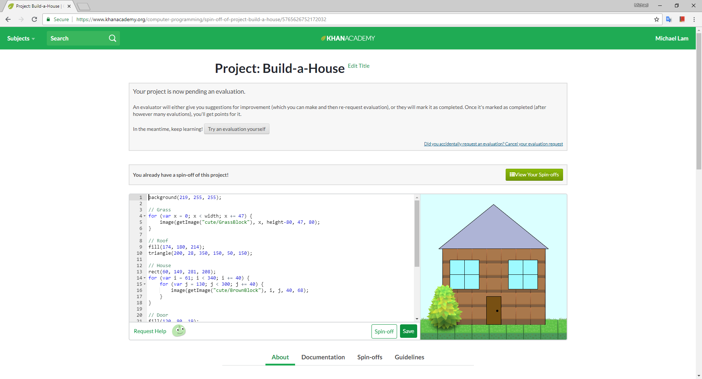
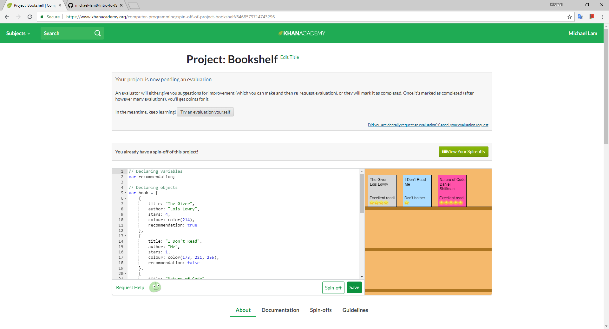

# Introduction to JavaScript – Khan Academy Projects
This repository contains [Khan Academy projects](https://www.khanacademy.org/profile/lam.michael/projects) from the Intro to JS subject.

**Note:** Some programs in this repository have been updated and reflect a later version than those on Khan Academy. In addition, they have been slightly modified to work with p5.js mode, but the functionality remains identical or improved.
## Preview
### Project 1: What's for Dinner?

### Project 2: Shooting Star

### Project 3: Animal Attack

### Project 4: Ad Design

### Project 5: Fish Tank

### Project 6: Magic 8-Ball

### Project 7: Build-a-House

### Project 8: Make It Rain

### Project 9: Bookshelf

**Note:** Mouse events may not work in Google Chrome. If so, please try again using a different browser, or download this repository and run the program using Processing.

Michael Lam  
ICS3U
